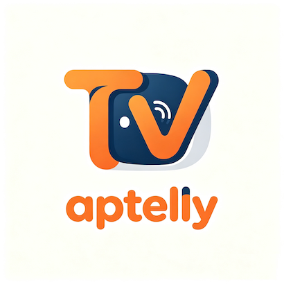
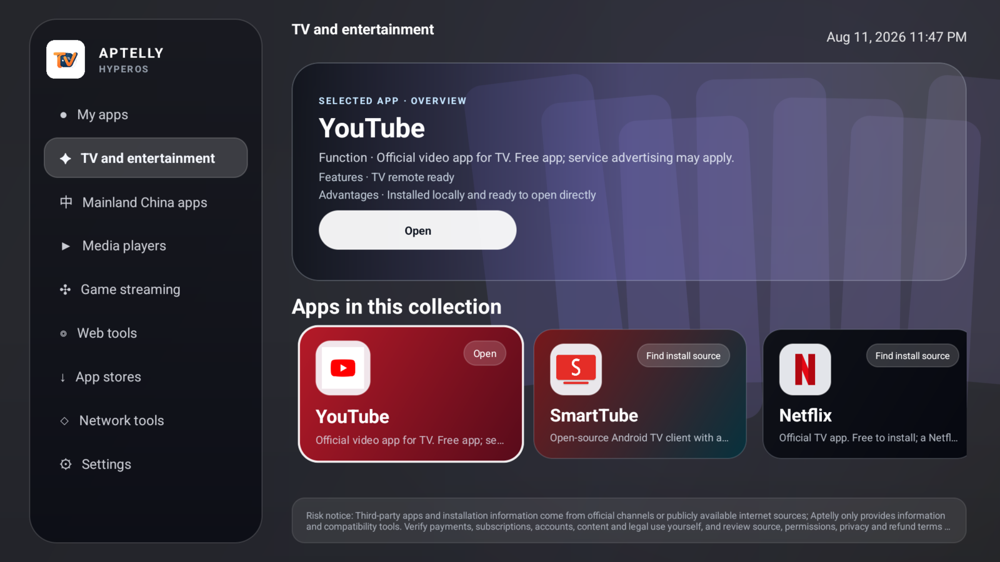
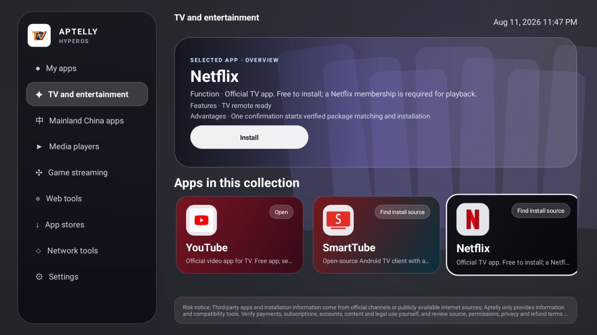
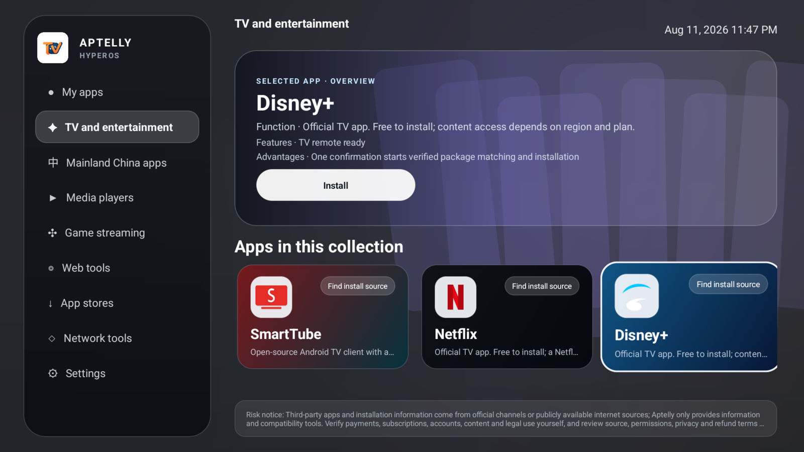

  <a href="README.md">English</a> ·
  <a href="README.zh-CN.md">简体中文</a> ·
  <a href="README.ja.md">日本語</a> ·
  <a href="README.ko.md"><strong>한국어</strong></a>

  

<h1 align="center">Aptelly™</h1>

<h3 align="center">TV 앱을 찾고, 알맞은 경로로 설치하세요</h3>

  TV에 앱 스토어가 없나요? 믿을 수 있는 설치 출처를 찾기 어렵나요? 모바일용과 TV용 앱을 구분하기 어렵나요? 
  Aptelly는 전 세계 인기 TV 앱과 유용한 도구를 리모컨으로 편하게 사용할 수 있는 하나의 Android TV 홈 화면에 모아 줍니다.

  Android TV 8.0 이상 · 리모컨 우선 · <a href="LICENSE">Apache-2.0 라이선스</a> · 영어, 중국어, 일본어, 한국어 안내

  <a href="https://github.com/AptellyTV/aptellyTV/releases/latest"><strong>최신 APK 다운로드</strong></a>
  · <a href="#전-세계-인기-tv-앱">앱 카탈로그</a>
  · <a href="#시작하기">설치 안내</a>
  · <a href="https://t.me/aptellytv_group">Telegram 커뮤니티</a>

  

> **한 문장으로 설명하면:** Aptelly를 사용하면 전 세계 인기 앱을 TV에 원클릭으로 설치할 수 있습니다.

## Aptelly가 해결하는 문제

| 흔한 문제 | Aptelly가 돕는 방법 |
|---|---|
| **설치 출처를 찾기 어렵습니다.** TV에 Google Play가 없거나 제조사 스토어에 원하는 앱이 없을 수 있습니다. | 인기 TV 앱, TV 앱 스토어, 신뢰할 수 있는 입수 경로를 한곳에 정리하여 리모컨으로 웹을 반복 검색하는 수고를 줄입니다. |
| **잘못된 버전을 받기 쉽습니다.** 검색 결과가 모바일용이거나 CPU 구조가 다르거나 리모컨을 지원하지 않는 앱일 수 있습니다. | TV 환경에 맞춰 더 적합한 스토어나 설치 경로를 표시합니다. 적합한 경로가 없다면 현재 사용할 수 없다는 사실을 분명하게 알려 줍니다. |
| **TV에서 설치하기가 번거롭습니다.** URL 입력, 웹 페이지 조작, 다운로드 파일 찾기가 모두 불편합니다. | 앱 카드에서 `열기`, `설치 출처 찾기`, `업데이트` 같은 작업을 바로 선택하여 불필요한 단계를 줄입니다. |
| **설치 후 앱 관리가 어렵습니다.** 아이콘이 기본 런처 곳곳에 흩어지거나 메뉴 깊숙이 숨을 수 있습니다. | 설치된 TV 앱을 리모컨 조작에 맞춘 하나의 대화면 인터페이스에 모아 줍니다. |

<table>
  <tr>
    <td width="33%" align="center"><strong>🔎 더 쉬운 검색</strong>  국내외 인기 TV 앱을 한곳에서 찾고, 포럼이나 파일 공유 사이트, 낯선 다운로드 페이지를 헤매는 일을 줄입니다.</td>
    <td width="33%" align="center"><strong>📦 잘못된 설치 감소</strong>  TV용과 모바일용 앱을 구분하고 버전, CPU, 기기 환경 불일치로 인한 실패를 줄입니다.</td>
    <td width="33%" align="center"><strong>📺 편리한 TV 관리</strong>  큰 카드, 선명한 포커스, D-pad 우선 탐색으로 앱 실행, 업데이트, 관리를 간단하게 만듭니다.</td>
  </tr>
</table>

## 전 세계 인기 TV 앱

Aptelly는 잘 알려진 타사 TV 앱과 설치 진입 경로를 지속적으로 정리합니다. 여기서 “출처”는 앱이나 앱을 얻는 경로를 의미하며, Aptelly가 영화, 채널 또는 스트리밍 콘텐츠를 직접 제공한다는 뜻은 아닙니다.

| 분류 | 대표 앱 및 도구 |
|---|---|
| 글로벌 영상 및 엔터테인먼트 | YouTube, Netflix, Disney+, Prime Video, Apple TV, HBO Max, Paramount+, Spotify, Twitch, Crunchyroll, Pluto TV, Tubi, Hulu, Peacock, DAZN, ESPN, F1 TV, Plex, Stremio, iQIYI, JioHotstar, Viu 등 |
| 중국 본토 TV 앱 | iQIYI(Galaxy Kiwi), Tencent Video(NewTV Aurora), Youku(CIBN Cool Meow), Mango TV, bilibili TV, CCTV TV |
| TV 앱 스토어 | Google Play, Amazon Appstore, Aurora Store, Aptoide TV, Xiaomi TV App Store |
| 플레이어 및 브라우저 | Jellyfin, Kodi, VLC, TV Bro |
| 네트워크 도구 | Clash Meta, Tailscale, WireGuard, OpenVPN |

### 익숙한 앱을 한눈에 확인

| 글로벌 인기 앱 | 무료 스트리밍 및 라이브 TV | 중국 본토 | 플레이어 및 유틸리티 |
|---|---|---|---|
| YouTube · Netflix · Disney+ · Prime Video · Apple TV · HBO Max · Paramount+ | Pluto TV · Tubi · FilmRise · Fawesome · Xumo Play · Twitch | Galaxy Kiwi · NewTV Aurora · CIBN Cool Meow · Mango TV · bilibili TV · CCTV TV | Kodi · VLC · Jellyfin · Plex · Stremio · Moonlight · Steam Link |

> **카탈로그에 있다고 해서 모든 TV에서 설치하거나 재생할 수 있다는 뜻은 아닙니다.** 실제 사용 가능 여부는 TV 모델, Android 버전, CPU 구조, Google 서비스, DRM 인증, 국가 또는 지역, 각 서비스의 계정 및 구독 조건에 따라 달라집니다. Aptelly는 경로와 상태를 더 명확하게 보여 주지만 이러한 제한을 우회하지는 않습니다.

## 실제 화면

| 설치됨: 바로 열기 | 설치되지 않음: 적합한 출처 찾기 |
|---|---|
|  |  |

## 시작하기

1. [Aptelly Releases](https://github.com/AptellyTV/aptellyTV/releases/latest)를 열고 `Aptelly-<버전>-release.apk`를 다운로드합니다.
2. USB 드라이브, ADB 또는 TV에 이미 있는 신뢰할 수 있는 다운로드 도구로 설치합니다. Android에서 해당 출처의 앱 설치 허용을 요청할 수 있습니다.
3. Aptelly를 열고 원하는 앱을 선택합니다. `열기`, `설치 출처 찾기`, `업데이트` 또는 현재 TV에서 사용할 수 없는 이유가 표시됩니다.

  <a href="https://github.com/AptellyTV/aptellyTV/releases/latest"><strong>Aptelly 다운로드 →</strong></a>

Aptelly는 **Android TV 8.0(API 26) 이상**을 지원합니다. 기본 TV 홈 화면으로 설정할지는 사용자가 선택할 수 있으며, 언제든지 원래 런처와 시스템 설정으로 돌아갈 수 있습니다.

## 자주 묻는 질문

<strong>카탈로그의 모든 앱을 바로 설치할 수 있나요?</strong>

 
항상 가능한 것은 아닙니다. Android 버전, CPU, 사용 가능한 앱 스토어, Google 서비스, DRM, 지역 조건은 TV마다 다릅니다. Aptelly는 적합한 경로가 확인된 경우 이를 표시하고, 현재 조건이 맞지 않으면 분명하게 알려 줍니다.

<strong>Aptelly가 영화, TV 프로그램 또는 구독 계정을 제공하나요?</strong>

 
아닙니다. Aptelly는 타사 TV 앱의 진입 경로만 정리합니다. 콘텐츠, 계정, 광고, 구독 및 이용 요금은 각 서비스 제공자가 관리합니다.

<strong>Google Play가 없는 TV에서도 사용할 수 있나요?</strong>

 
Aptelly 자체는 설치할 수 있지만 각 타사 앱의 사용 가능 여부는 TV 환경에 따라 달라집니다. 필요한 경우 제조사 스토어, Aurora Store, Aptoide TV 및 공식 프로젝트 출처를 안내합니다.

<strong>Aptelly가 다른 앱을 몰래 설치하나요?</strong>

 
아닙니다. 최종 설치 확인은 Android가 표시하며 언제든지 취소할 수 있습니다.

## 라이선스

Aptelly는 [Apache License 2.0](LICENSE)에 따라 제공됩니다.
